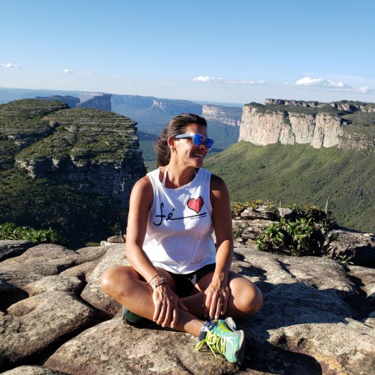
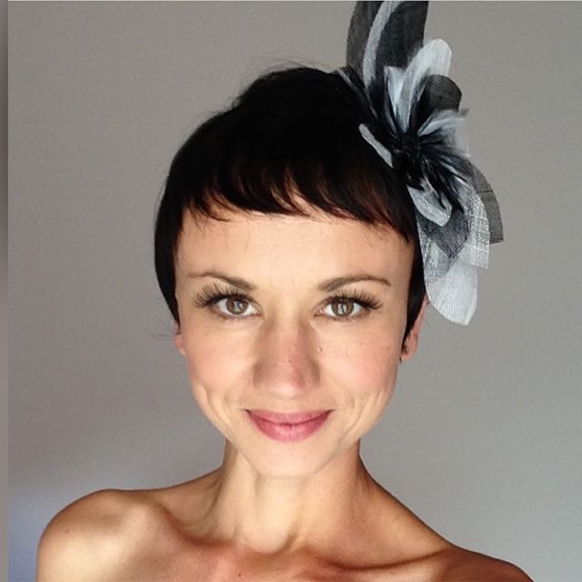
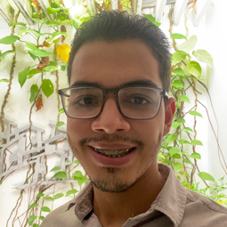

# Desafio Obesidade Infantil - Time 15 

## Integrantes:
||||||
|---|---|---|---|---|
|[Febing20](https://github.com/febing20)|[Joao Prado](https://github.com/jppradoleal)|[Paula Campos](https://github.com/Paulacamposro)|Mikael França|[Adalberto Brant](https://github.com/adalbertobrant)|
 

# Sobre:
Diante do grande problema da inconsitência de dados disponibilizados e a elitização de informações detalhadas no SisVan e outros sistemas, nós do time 15 decidimos gerar novos dados! A Caderneta Digital se disponibiliza como uma ferramenta para auxiliar os pais no monitoramento da saúde dos seus filhos, enquanto fornece dados a nutricionistas.

# Instruções para Execução
* Clone este repositório e o [backend](https://github.com/jppradoleal/hackathon-saude-infantil-time-15)

* Instale as dependências de cada um, executando `npm install` em cada raiz dos projetos.

* Renomeie o `.env.example` para `.env` e preencha as chaves conforme as instruções.

* Rode `npm start`.

* Acesse o frontend através de `localhost:3000`.

# Planejamento

[Miro Files](https://miro.com/app/board/o9J_khtMfM0=/)

# Recursos

* [Gráfico](https://c3js.org/gettingstarted.html)
* [Exemplo de questionário](https://global.rethinkobesity.com/patients.html#section-weight-management-goals)
* [Fatores de Risco para a Criança Pesquisa sobre Obesidade](https://www.scielo.br/scielo.php?script=sci_arttext&pid=S0034-71672010000100012)
* [Ambiente Obesogênico](https://www.scielo.br/scielo.php?script=sci_arttext&pid=S0021-75572016000400030&lng=pt&tlng=pt)